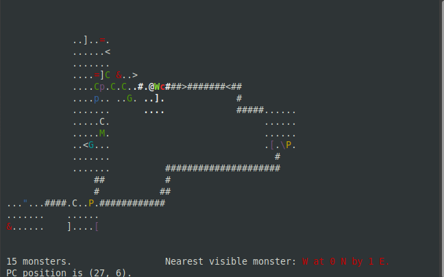
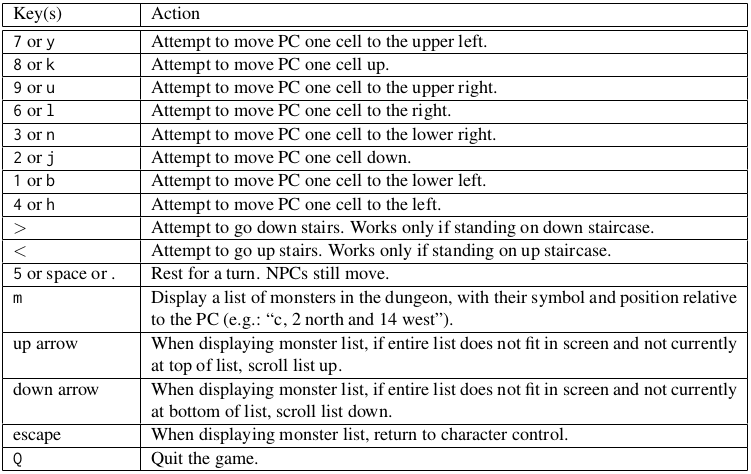
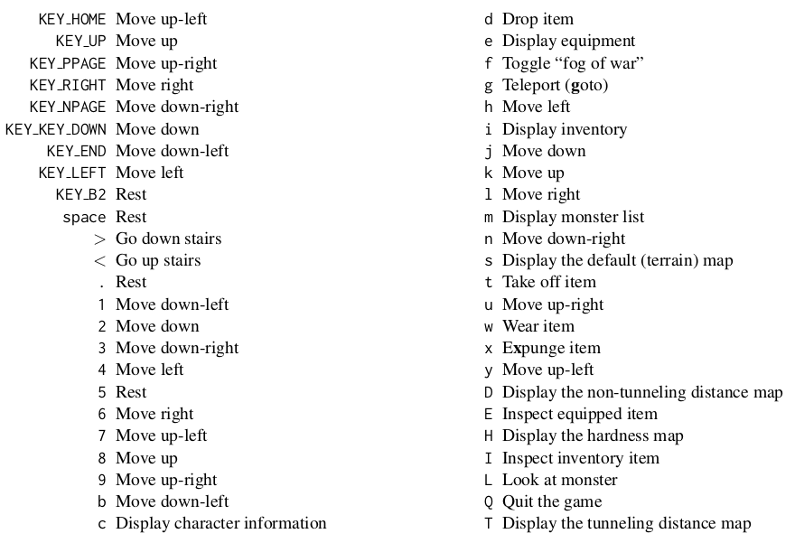

# Terminal Based Roguelike in C and C++



A roguelike game for Com S 327 at Iowa State University. Built in C and C++ with Ncurses.

Each folder represents the first to last assignment which halfway through transitions from C to C++. The last assignment in C is 1.05, all subequent assignments are in C++.
Each assignment builds on the last so the code may be viewed as a story through commit logs, README's, and assignment pdfs.

## Dependencies

If using ubuntu you can just paste this in your terminal:
```bash
sudo apt install gcc-8 g++-8 libncurses5-dev
```

### GCC and G++ To compile or make .c and .cpp files respectively

GCC-8 and G++-8 were used for this project but it should work fine with other versions.
GCC-8 (for Ubuntu, sudo apt install gcc-8)
G++-8 (for Ubuntu, sudo apt install g++-8)

### NCurses

For Ubuntu, sudo apt install libncurses5-dev

There are more ncurses packages if desired such as debugging packages and can be found with "apt-cache search libncurses".

## How to play

```bash
cd FINAL_VERSION
make
./rlg327
```

### Keybindings

There are too many to list. Check here for basic movement such as arrow keys, equip items with 'w' and more. Includes debug bindings such as teleport and toggling of fog of war. Prompts will be shown on screen to assist. Escape will exit the current prompt and 'Q' will exit the game.





### Opional tags

There are quite a few:
 - (-n/-nummon X) sets the number of monsters in your dungeon to X
 - (-s/--save) saves the dungeon to $HOME/.rlg327 after it is generated (not useful)
 - (-l/--load) loads a saved dungeon (must exist in $HOME/.rlg327) (also not useful)
 - (-i/--image filename) creates a dungeon based on a black and white pgm file
 - (-o/--objcount X) creates X number of objects in your dungeon
 - (-r/--rand X) creates a dungeon based on X as your seed

If incorrect useage is given, you will see this printed to stderr:
Usage: %s [-r|--rand <seed>] [-l|--load [<file>]] [-s|--save [<file>]] [-i|--image <pgm file>] [-n|--nummon <count>] [-o|--objcount <oject count>]


## Object and Monster description files

You are able to add your own monsters and objects to be loaded by the game as long as your format follows the ones already provided.
Screenshots of the descriptions that are possible:


